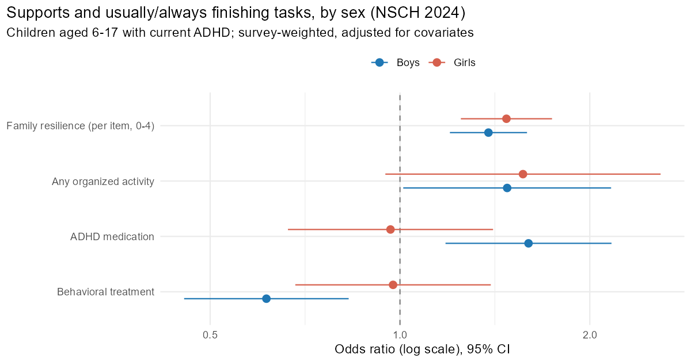
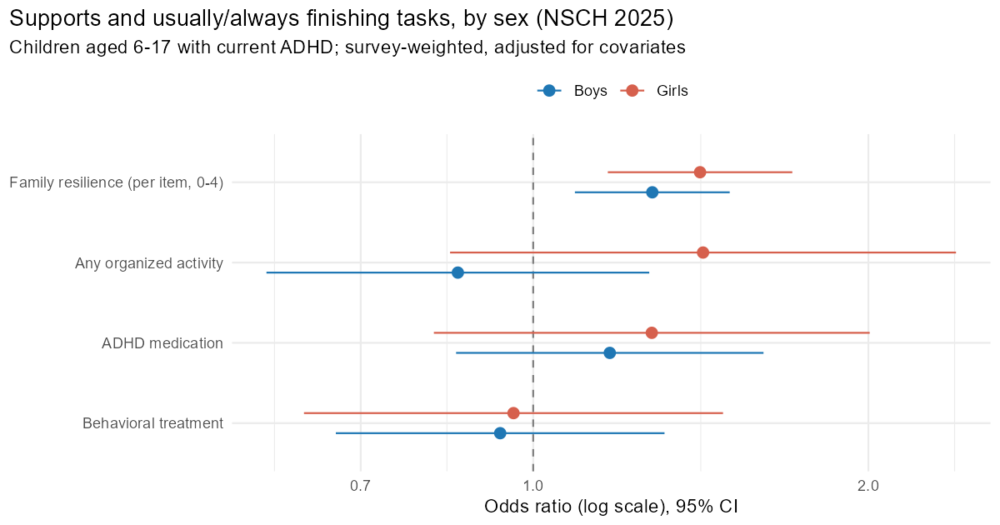

# Supports and Day-to-Day Functioning in Children With ADHD, by Sex

A pre-registered, design-based analysis of national survey data: among U.S. children
with ADHD, which supports go along with better everyday functioning, and does that
pattern differ for girls and boys?

## Research question

Among children aged 6-17 with a parent-reported current ADHD diagnosis, are family
connection, organized activities, and treatment associated with how often a child
works to finish the tasks they start? Do those associations differ by sex?

The question is strengths-based (what goes *with* better functioning, not only what goes
wrong), and the sex comparison matters because ADHD in girls has historically been
under-recognized.

## Pre-registration

The [analysis plan](ANALYSIS_PLAN.md) was written first, its variables were mapped
against the codebook without looking at outcomes ([variable map](output/variable_map.md)),
and it was locked in a public Git commit (`1ce5acc`, 8 Oct 2026) before any outcome
analysis was run. Every departure and every detail the plan left open is logged in
[DEVIATIONS.md](DEVIATIONS.md) (7 items, none changing a hypothesis or model).

## Data

- **Source:** National Survey of Children's Health (NSCH), 2024 topical public-use file,
  conducted by the U.S. Census Bureau for HRSA's Maternal and Child Health Bureau. The
  2025 file is used as an independent replication.
- **Analytic sample (2024):** 6,000 children aged 6-17 with current ADHD and an observed
  outcome (3,738 boys, 2,262 girls), representing about 6.7 million U.S. children.
  Models use the 5,442 children complete on every model variable (3,379 boys,
  2,063 girls). Replication (2025): 4,717 children.
- **Sanity checks:** the 2024 file gives 44,606 children aged 3-17 with an ADHD response
  and a weighted current-ADHD prevalence of 11.7%, matching published figures.
- **Measures** (full coding in the plan):
  - *Outcome:* "How often does this child work to finish tasks they start?",
    usually/always vs. sometimes/never (cutpoint fixed before viewing).
  - *Family connection:* number of four family-resilience items ("when your family faces
    problems...") answered "all/most of the time" (0-4), using the item coding of the
    Data Resource Center for Child and Adolescent Health.
  - *Organized activity:* any sports, clubs, or organized lessons in the past year.
  - *Treatment:* current ADHD medication; behavioral treatment in the past year.
  - *Covariates:* age, ADHD severity, race/ethnicity, household income (six Census
    imputations), parent education, insurance type, number of co-occurring conditions.

The NSCH microdata are not redistributed here; see *Reproduce*.

## Method

- **Design-based inference** with the R `survey` package: child weight `FWC`, strata of
  state x sampling stratum, households as primary sampling units, Taylor-series variance.
  The ADHD group is analyzed as a subpopulation of the full design.
- **Model 1:** survey-weighted logistic regression of the outcome on sex, the four
  supports, and covariates. **Model 2:** adds four sex x support interactions, tested
  jointly (Wald) and then individually with Holm correction.
- **Income** is multiply imputed by the Census Bureau, so every model is fit six times
  and combined with Rubin's rules.
- Results are odds ratios with 95% CIs and survey-weighted predicted probabilities.
- **Sensitivity checks:** an ordinal model of all four response options; adding an
  adverse childhood experiences (ACE) count; excluding children with autism; and the full
  primary analysis repeated on 2025 data.

## Results

### Family connection: consistent in every analysis

Each additional family-resilience item was associated with higher odds of usually or
always finishing tasks: **OR 1.42 (95% CI 1.27-1.59) in 2024** and **1.33 (1.17-1.50) in
the 2025 replication**. The association appeared for boys and girls separately, in both
years, and in all three sensitivity checks.

| Usually/always finishes tasks (weighted, predicted) | 2 items | 4 items |
|---|---|---|
| Boys, 2024 | 37.0% | 50.5% |
| Girls, 2024 | 37.4% | 54.2% |
| Boys, 2025 | 42.1% | 52.5% |
| Girls, 2025 | 37.6% | 52.0% |

### Other supports: associations in 2024 that did not replicate

| Support (Model 1, OR, 95% CI) | 2024 | 2025 |
|---|---|---|
| Any organized activity | 1.53 (1.14-2.05) | 1.03 (0.75-1.41) |
| ADHD medication | 1.31 (1.02-1.68) | 1.21 (0.92-1.57) |
| Behavioral treatment | 0.73 (0.58-0.92) | 0.94 (0.71-1.25) |

All three were statistically distinguishable from no association in 2024 and mostly held
across the 2024 sensitivity checks, with two exceptions: behavioral treatment in the
ordinal model (0.86, 0.68-1.09) and medication after adding ACEs (1.29, 0.997-1.66). None was distinguishable from no association in 2025, though
medication and behavioral treatment pointed the same way. The lower odds with behavioral
treatment were not predicted in a direction (H1c): children with greater difficulties
are more likely to be referred for treatment, so a negative association does not mean
treatment is unhelpful.

### Sex differences: not supported

The four sex x support interactions were not jointly significant in the primary analysis
or in any check:

| Specification | n | Joint test (4 df) | Smallest Holm-adjusted p |
|---|---|---|---|
| Primary, 2024 | 5,442 | chi-sq 7.21, p = .125 | .131 (medication) |
| Ordinal outcome | 5,442 | chi-sq 2.99, p = .560 | .630 |
| + ACE count | 5,251 | chi-sq 5.82, p = .213 | .159 |
| Excluding autism | 4,451 | chi-sq 8.36, p = .079 | .203 |
| **Replication, 2025** | 4,717 | chi-sq 3.12, p = .537 | .498 |

In 2024 the medication association looked weaker for girls (girls OR 0.97 vs boys 1.60;
interaction p = .033 before correction, .131 after), but this did not survive correction
and did not appear in 2025 (girls 1.28, boys 1.17). The secondary, exploratory outcome
("stays calm when challenged") also showed no reliable sex differences (joint test
p = .254).




### Summary

Family connection was the one support associated with better task completion that held
in every analysis and replicated in independent data, and it did so similarly for girls
and boys. Associations with activities and treatment were not stable across years, and
there was no reliable evidence that any support works differently by sex. One possible
reading is that family-level resilience is a broad correlate of functioning for children
with ADHD regardless of sex; that is a hypothesis, and this design cannot test it.

## Limitations

- **Cross-sectional and parent-reported.** No causal claims: every result is an
  association. The same parent reports both the supports and the outcome, which can
  inflate associations (shared-reporter bias).
- **Reverse causation and confounding by indication.** Children who are struggling may
  receive more supports, especially treatment.
- **Selection by diagnosis.** Girls have historically been under-diagnosed, so diagnosed
  girls may differ systematically from diagnosed boys. A sex difference here, or its
  absence, is not necessarily a sex difference in ADHD.
- **Population.** Inference is to U.S. children with a parent-reported diagnosis, not to
  all children with ADHD, and not to adults.
- **Measurement.** The outcome is a single item, and the supports are coarse (for example,
  "any organized activity" in the past year).
- **Missing data.** Complete-case analysis drops 9% of the analytic sample (6,000 to
  5,442); no single model variable exceeded 5% missing. See DEVIATIONS.md, item 6.
- **Power for interactions.** With about 2,000 girls, moderately sized sex differences
  may go undetected; "not supported" is not the same as "shown to be equal".

## Reproduce

Requires R (4.6 used) with `haven`, `survey`, `srvyr`, `tidyverse`, and `mitools`.

1. Download from census.gov into `data/raw/` and unzip the two Stata archives:
   - `nsch_2024_topical_Stata.zip` and `nsch_2025_topical_Stata.zip`
     (https://www2.census.gov/programs-surveys/nsch/datasets/)
   - The 2024 and 2025 Topical Variable Lists and the NSCH Analytic Guide (optional,
     for checking the variable map)
2. From this folder, run:

```
Rscript R/01_clean.R 2024
Rscript R/01_clean.R 2025
Rscript R/02_table1.R 2024
Rscript R/03_models.R 2024 finish
Rscript R/03_models.R 2024 calm
Rscript R/03_models.R 2025 finish
Rscript R/04_sensitivity.R
```

All tables and figures are written to `output/`. Key files:
[Table 1](output/table1_2024.md), [model odds ratios](output/models_or_finish_2024.csv),
[interaction tests](output/interaction_tests_finish_2024.csv),
[sensitivity table](output/sensitivity_table.csv), and
[2024 vs 2025 replication](output/replication_2024_vs_2025.csv).

**Data citation:** U.S. Census Bureau, National Survey of Children's Health, 2024 and
2025 Topical Public Use Files. Sponsored by the Health Resources and Services
Administration, Maternal and Child Health Bureau.
