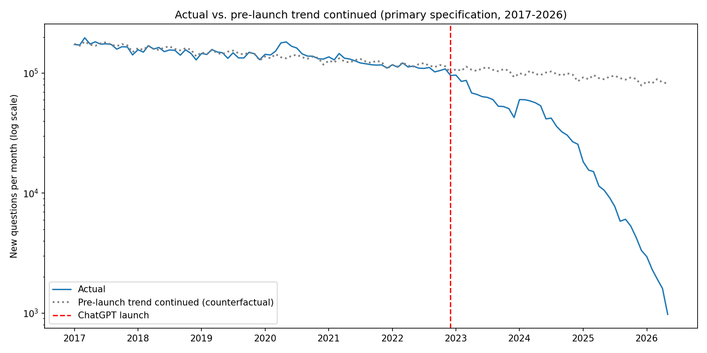
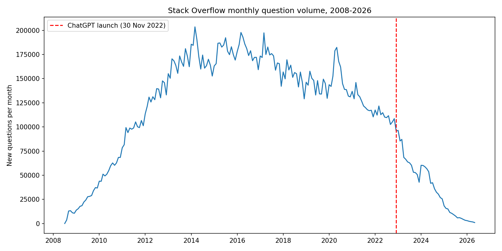

# AI and Help-Seeking: Stack Overflow's Decline After ChatGPT

An interrupted time series analysis of a real-world shift in where people go to solve
problems, as behavioral evidence relevant to **cognitive offloading**: delegating
reasoning or memory work to an external tool (Sparrow et al., 2011).

## Research question

Did the way people use Stack Overflow change after ChatGPT launched (30 Nov 2022), beyond
what the pre-launch trend would predict?

## Data

Monthly counts of new questions on Stack Overflow, July 2008 to May 2026 (215 months).
The counts come from a publicly posted monthly count query run against the Stack
Exchange Data Explorer, shared in a GitHub gist (`hopeseekr`) that the author updated
through 2026. The numbers were transcribed by hand from that gist into `data.csv`
and checked for gaps and duplicates; they were not independently re-queried. To
reproduce from the source, run an equivalent count-of-questions-by-month query at
data.stackexchange.com.

## Method

Interrupted time series regression on log(monthly questions), so effects read as
percent change per month:

```
log(questions) ~ t + post + t*post + month-of-year dummies
```

`t*post` is the change in trend after launch (first full post month: Dec 2022). Month
dummies absorb seasonality; HAC (Newey-West, 12 lags) standard errors handle
autocorrelation.

I report four specifications instead of one:

| Spec | Window | Extra post-launch trend (per month) | 95% CI | Net post-launch trend |
|---|---|---|---|---|
| A. Full history | 2008-2026 | -10.5% | -13.0 to -7.9 | -9.6% |
| **B. Primary** | 2017-2026 | **-9.0%** | -11.1 to -6.7 | -9.6% |
| C. Drop May 2026 (possibly partial) | 2017-2026 | -8.6% | -10.7 to -6.5 | -9.2% |
| D. Shorter pre-period | 2019-2026 | -8.4% | -10.5 to -6.3 | -9.2% |

Spec B is primary because a single straight line through 2008-2022 mixes the site's
growth years with its decline years (it gives a misleading +1%/month "pre-trend" in spec
A). The pre-launch trend under B is about **-0.7% per month**. B was designated primary in the script
before any results were run; the other specifications are reported so the result can be
checked against that choice.

## Results

Question volume fell by roughly **9% per month, on average, after the launch**, versus a
slow pre-launch decline of under 1% per month. That compounds to roughly a halving every
7 months. The slope change is statistically distinguishable from zero in every
specification, and the estimate moves only from -8.4% to -10.5% across them.




## Limitations

- **A behavioral proxy, not a cognitive measure.** The data show people moved away from a
  public human Q&A site. They do not show whether anyone's reasoning, learning, or skill
  changed. Testing that needs individual-level data (surveys or experiments).
- **No comparison group.** Other things changed over the same period and are not modeled,
  for example Stack Overflow's own moderation culture and policy changes, shifts in
  search and tech-sector hiring, and the 2020 pandemic surge visible in the series. This
  design cannot separate AI substitution from them.
- **Gradual decline, not a sudden break.** The immediate "level shift" estimate flips
  sign between specifications, so I don't interpret it; the slope change is the
  result. A straight line in logs also understates how much the decline accelerated.
- **Data vintage.** Monthly counts can be revised as posts are deleted, and the final
  month may be partial. Spec C shows the result holds without it.
- **A selected population.** People who post public questions are not a random sample of
  people who write code.

## Reproduce

```
pip install -r ../requirements.txt
python analysis.py
```

Writes `results.txt` (all four specifications) and both figures to this folder.
