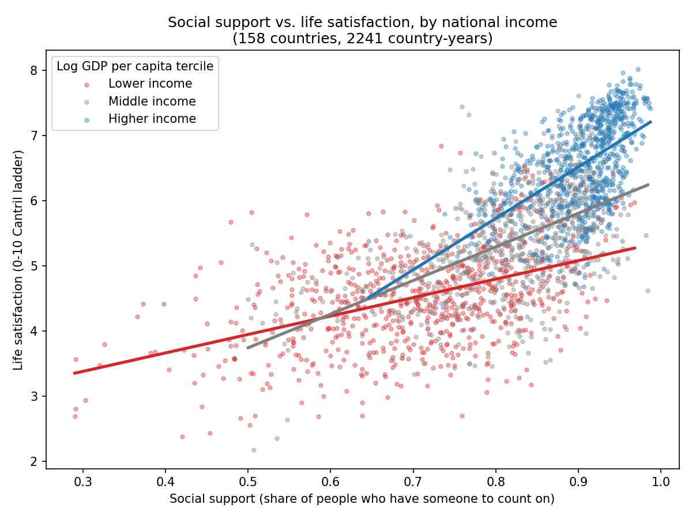
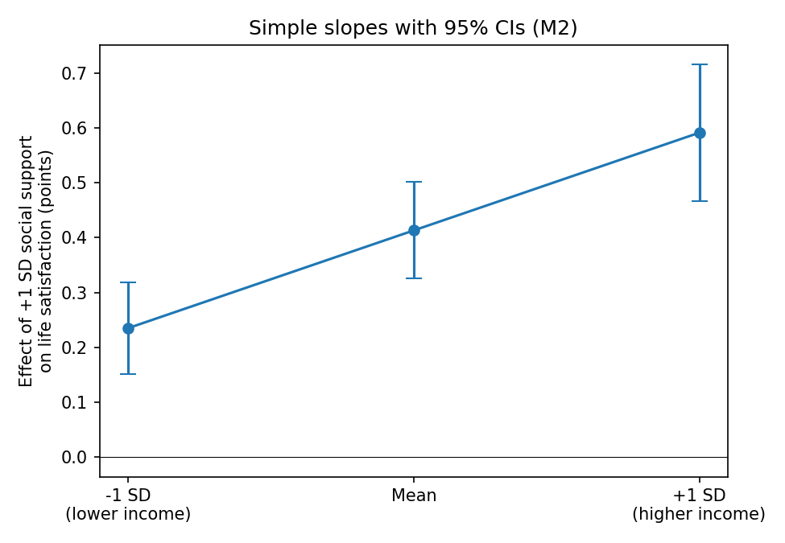

# Social Support, National Income, and Life Satisfaction

A cross-national panel analysis of whether the link between social support and life
satisfaction depends on how wealthy a country is.

## Research question

Does social support "buffer" the effects of economic hardship, so that it matters
*more* for well-being in lower-income countries? Or does its association with life
satisfaction scale differently with national income?

## Data

- **Source:** World Happiness Report panel (Gallup World Poll survey data plus World
  Bank/WHO indicators), 2005-2023. This repo uses a public copy of the WHR 2024 update
  (`semypak/data` on GitHub); the original is published at worldhappiness.report.
- **Full panel:** 2,363 country-years across 165 countries.
- **Analysis sample:** 2,241 country-years across 158 countries, after dropping rows
  with missing values on any model variable. The panel is unbalanced (countries are
  surveyed in different years).
- **Variables:**
  - *Life satisfaction* - national average Cantril ladder score (0-10)
  - *Social support* - share of respondents who say they have relatives or friends
    they can count on in times of trouble
  - *Log GDP per capita*, *healthy life expectancy*, *freedom to make life choices*

These are the raw survey and economic measures, **not** the "explained by" component
columns that the WHR publishes. Those components are derived from a regression on the
happiness score itself, so using them as predictors would be circular.

## Method

OLS regression with predictors standardized (z-scores), so coefficients are the change
in life satisfaction (points on the 0-10 scale) per 1 SD of the predictor. Standard
errors are clustered by country because each country contributes repeated observations.

| Model | Specification |
|---|---|
| M1 | Main effects + year fixed effects |
| M2 | M1 + social support x log GDP interaction (the moderation test) |
| M3 | M2 + country fixed effects (robustness check: only within-country change over time) |

## Results

- **Social support predicts life satisfaction beyond income** (M1): +0.29 points per SD
  (95% CI 0.20 to 0.38), controlling for GDP, health, and freedom.
- **The association is stronger in higher-income countries** (M2): interaction = +0.18
  (95% CI 0.12 to 0.24). Simple slopes of social support: **0.24** at -1 SD of income,
  **0.41** at the mean, **0.59** at +1 SD (all p < .001).
- **Robustness (M3):** with country fixed effects the interaction shrinks to +0.10
  (95% CI 0.01 to 0.20, p = .027). It stays positive but is smaller and less precisely
  estimated, so most of the pattern comes from differences *between* countries rather
  than from change *within* countries over time.

The pattern runs opposite to a simple buffering hypothesis. One possible explanation is
that when basic material needs are less pressing, relationships become a larger
differentiator of well-being. That explanation is a hypothesis; this analysis does not
test it.




## Limitations

- **Ecological, observational data.** These are country-level averages, so the results
  describe patterns across countries, not effects on individual people, and they cannot
  show causation.
- **Measurement.** "Social support" is a single yes/no survey item averaged by country,
  and it may not mean the same thing across cultures.
- **Interaction form.** The model assumes a linear moderation effect. GDP, life
  expectancy, and social support are also correlated with one another.
- **Missing data** were dropped (listwise), which assumes they are not systematically
  related to the outcome.

## Reproduce

```
pip install -r ../requirements.txt
python analysis.py
```

Writes `results.txt` and both figures to this folder.
